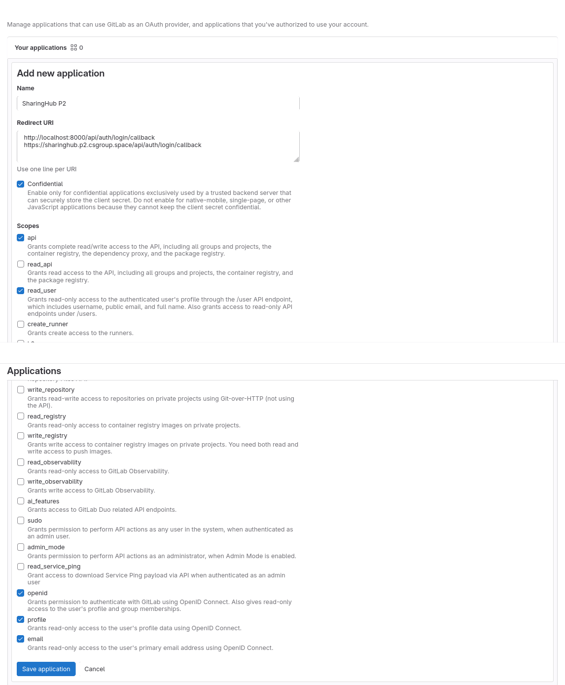

# SharingHub

## Table of contents

- [Roadmap](#roadmap)
- [Setup](#setup)
- [Development](#development)
- [Production](#production)
  - [Build](#build)
  - [Push](#push)
  - [HELM](#helm)
    - [Robot account](#robot-account)
    - [GitLab Authentication](#gitlab-authentication)
    - [Default token](#default-token)
    - [Deployments](#deployments)
      - [CS SharingHub](#cs-sharinghub)
      - [CNES SharingHub](#cnes-sharinghub)
- [Configuration](#configuration)

## Roadmap

The goal here is to establish a plan on the developments of SharingHub, with the different requirements for each release.

- **Release v0.1.0 (v0.1.X): MVP**

  The goal of this release is to implement the minimum set of features to have a functioning and cohesive platform. This version could be used for demonstrations and deployed as such, independently from the development one. Fixes can be added, but no new features implemented. Milestone [here](https://gitlab.si.c-s.fr/groups/space_applications/mlops-services/-/boards?milestone_title=v0.1.0).

- **Release v1.0.0 (v1.X.Y): Industrialized, first stable**

  After the v0.1.0, we will work on the industrialization of the SharingHub. It is important to refactor and improve the software architecture to create a robust base for future developments. We will also add here the QA tools and create the CI/CD pipelines. Small new features and bug fixes can be added after, as long as they do not overstep on the boundaries of the next release. Milestone [here](https://gitlab.si.c-s.fr/groups/space_applications/mlops-services/-/boards?milestone_title=v1.0.0).

## Setup

You will need first to update the submodules.

```bash
git submodule init
git submodule update
```

## Development

Python 3.11 required.

Setup the environment:

```bash
python -mvenv .venv
source .venv/bin/activate
```

Install the [pre-commit](https://pre-commit.com/) hooks:

```bash
pre-commit install --install-hooks
```

The components are in the folder `components/`, and each of them can be locally run for development.

Go to each repository, setup the environment, and run them!

## Production

### Build

You must first build the images of each components:

- `sharinghub-server`
- `sharinghub-ui`
- `sharinghub-docs`

Each component describes its build steps in their own `README.md`.

We assemble these images as one image, the `sharinghub` image:

```bash
docker build . -t 643vlk6z.gra7.container-registry.ovh.net/space_applications/sharinghub:latest
```

### Push

You can now push the final image:

```bash
docker push 643vlk6z.gra7.container-registry.ovh.net/space_applications/sharinghub:latest
```

### HELM

#### Robot account

Create a robot account in the harbor interface to access GeoJson Proxy Image

```bash
kubectl create namespace sharinghub

kubectl create secret docker-registry regcred --docker-username='robot$space_applications+p2.gitlab2stac' --docker-password='<password>' --docker-server='643vlk6z.gra7.container-registry.ovh.net' --namespace sharinghub
```

#### GitLab Authentication

Configure an application in the GitLab instance for OpenID connect authentication:

Callback URLs example:

```txt
http://localhost:8000/auth/login/callback
<deployment-url>/api/auth/login/callback
```

> Note: localhost URL is for development purposes, if you don't want it you can remove it.



You will be given a secret, and an application id.
Save them, you will need them when creating your deployment secrets.

#### Default token

The default token can be a personal Access Token, or a Group Access Token. Group tokens needs at least the role `Reporter`, and the scopes `read_api`, `read_repository`. Personal tokens needs `api` scope.

#### Deployments

##### CS SharingHub

The client ID is the application id from of the [configured application](#gitlab-authentication), and the client secret is the application secret. The default token is documented [here](#default-token).

```bash
# Install
kubectl create secret generic sharinghub --from-literal session-secret-key="<uuid>" --namespace sharinghub
kubectl create secret generic sharinghub-oidc --from-literal client-id="<client-id>" --from-literal client-secret="<client-secret>" --namespace sharinghub
kubectl create secret generic sharinghub-s3 --from-literal access-key="<access-key>" --from-literal secret-key="<secret-key>" --namespace sharinghub

# Install & Update
helm upgrade --install -n sharinghub --create-namespace sharinghub ./deploy/helm/sharinghub -f ./deploy/helm/values.yaml
```

##### CNES SharingHub

The default token is documented [here](#default-token).

```bash
# Install
kubectl create secret generic sharinghub-cnes --from-literal session-secret-key="<uuid>" --namespace sharinghub
kubectl create secret generic sharinghub-cnes-oidc --from-literal default-token="<token>" --namespace sharinghub

# Install & Update
helm upgrade --install -n sharinghub --create-namespace sharinghub-cnes ./deploy/helm/sharinghub -f ./deploy/helm/values.cnes.yaml
```

## Configuration

Please check the server configuration in its [CONFIGURATION.md](./components/server/CONFIGURATION.md).
